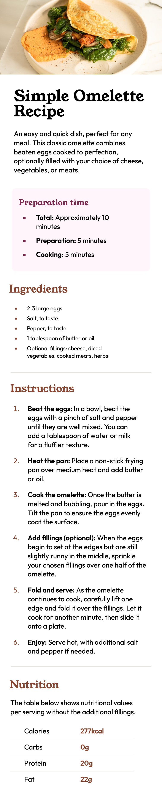
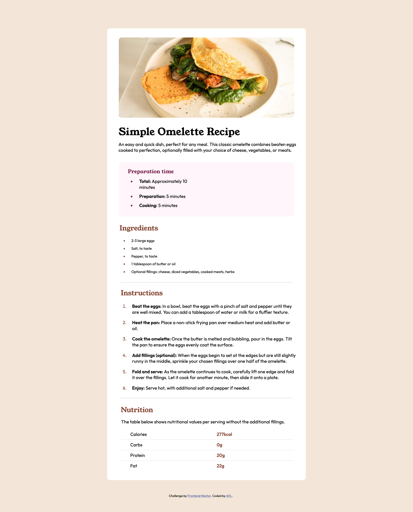

# Frontend Mentor - Recipe page solution

This is a solution to the [Recipe page challenge on Frontend Mentor](https://www.frontendmentor.io/challenges/recipe-page-KiTsR8QQKm). Frontend Mentor challenges help you improve your coding skills by building realistic projects.

## Table of contents

- [Overview](#overview)
  - [The challenge](#the-challenge)
  - [Screenshot](#screenshot)
  - [Links](#links)
- [My process](#my-process)
  - [Built with](#built-with)
  - [What I learned](#what-i-learned)
  - [Continued development](#continued-development)
  - [AI Collaboration](#ai-collaboration)
- [Author](#author)

## Overview

This project is a solution to the Frontend Mentor Recipe Page challenge. The goal was to build a responsive recipe page that matched the designs provided.

### Screenshot

### Links

- Github URL: https://github.com/arielvonlestat/Responsive-Recipe-Page

- Live Site URL: https://arielvonlestat.github.io/Responsive-Recipe-Page/

## My process

With all transparency, I am going back and writing this after improving everything. I did not fully understand what the README files were for when I originally did the challenge. However, after going back with a fresh set of eyes and new knowledge I decided to do it!

This has been very similar to the way i've approached all of my improvements upon past challenges. I started with looking at the CSS. I got rid of any redundancies that were unneeded. I continued to clean up any of the code that seemed inefficent. This included things like changing multiple padding to a single padding and setting up a direct :root system for keeping colors organized.

The biggest thing that I struggled with during this challenge was the responsiveness. Ironically that was basically the point of the challenge and I thought maybe i'd take a different approach to how I did things. However, this approach meant that I was taking items in the Mobile version and making them too ridgid and therefore when I went to the desktop version then I had to redo everything. I'm sure I could improve further upon this but short of starting over I wasn't sure where to go with it.

I updated the HTML to not sure "br" elements and to do all of that in CSS. In this lesson I really focused on accessibility and the suggestions that the Frontend Mentor AI provided.

Lastly, I redid the README.md file. As I have stated before I did not fully understand that I was supposed to do this as reflection on every challenge. So I will do so going forward.

### Built with

- Semantic HTML5 markup
- CSS custom properties
- Flexbox
- CSS Grid
- VS Code

### What I learned

Biggest take aways from this challenge was to take away the "br" element and use the "gap" propety in CSS. I not only learned that I could do this but that it is also much better for accessibility.

To that avail I also learned that I should be adding scope="row" to my table headers so that the screen reader knows that each header is a seperate row. I will endavor to keep this in mind for accessibility going forward. I feel like i'm learning so much in that regard!

Finally, as stated earlier, I learned a lot about responsiveness in this challenge. I learned that I need to use rems & percentages in order to be responsive with larger formats (as I typically work on the mobile version first). When I first did this challenge I had exact measurements which meant that when the screen became larger everything was discombobulated and that mean I had to use more and more media quieries to get what I needed to look right in the desktop version. Even though it's not entirely true it felt like I had to rewrite the entire CSS just to make up for this. I was able to delete a lot of what I had prior by just making things more fluid (as stated above). This is the most important lesson I learned!

### Continued development

I think at this point I am ready to move on to learning javascript. I am by no means an expert at CSS but I feel a lot more confident in my skills now. I will continue to go back through my old challenges and improve them. I will possibly continue with Frontend Mentor's challenges until I reach one with Javascript and then stop to dig into that.

### AI Collaboration

- What tools did you use (e.g., ChatGPT, Claude, GitHub Copilot)?

As mentioned above I used ChatGPT.

- How did you use them (e.g., debugging, generating boilerplate, brainstorming solutions)?

I am always very careful in the way that I use it. I do not want it doing the work for me and therefore I only ask it specific questions to understand better. Typically overall concepts, or generalized ideas. I am careful not to ask it to just completely do something for me as I do not feel like I learn that way. If it does give me more information than I want (which it has from time to time) then I spend a lot of time understanding why the answer or concept works and if it doesn't explain it in a way I can understand I asked questions to make sure I understand it.

- What worked well? What didn't?

It is great as an overall teacher when I have a specific question or a concept that I need to learn. However I have also caught it to be wrong on more than a few occasions which i've been proud of my abilities to realize that it was wrong but it is certainly something to be mindful of.

## Author

- Frontend Mentor - [ArielVonLestat](https://www.frontendmentor.io/profile/arielvonlestat)
